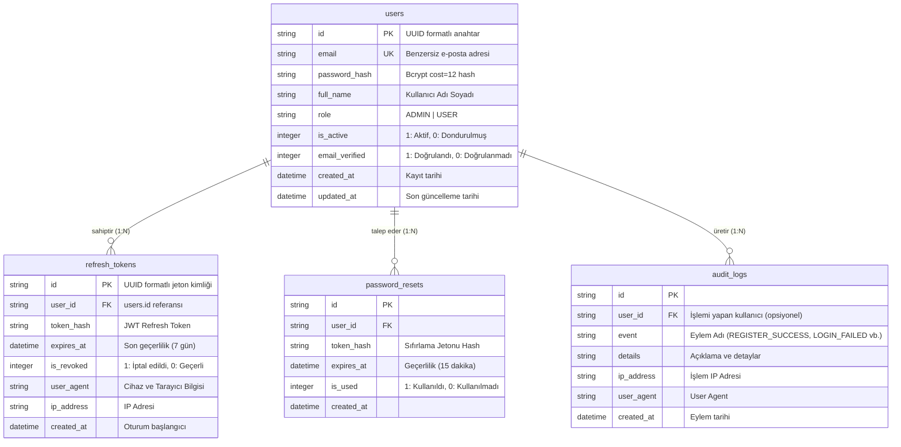
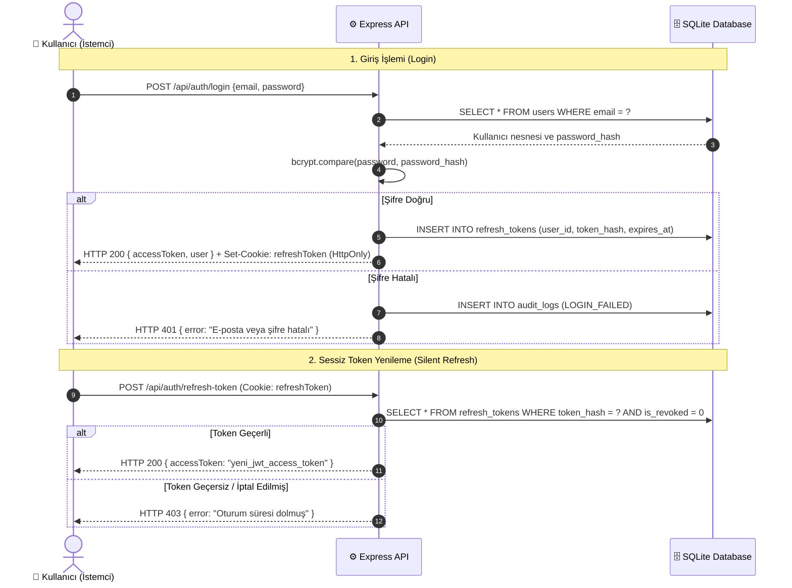

# AuthCore — Detaylı Sistem Mimarisi ve Teknik Dökümantasyon

Bu doküman, **AuthCore** üretim standartlarındaki (production-grade) full-stack kullanıcı giriş, kayıt, yetkilendirme ve veritabanı yönetim sisteminin uçtan uca mimari mimarisini, veri modellerini, güvenlik protokollerini ve API sözleşmelerini detaylandırmaktadır.

---

## 📐 1. Genel Sistem Mimarisi (System Overview)

AuthCore, **3 Katmanlı Kurumsal Mimari (3-Tier Enterprise Architecture)** prensiplerine göre tasarlanmıştır. Güvenlik, performans ve modülerlik odaklı bu katmanlar şunlardır:

```mermaid
graph TD
    subgraph Katman 1: İstemci Katmanı (Client Layer)
        ReactApp[💻 React + Vite Single Page Application]
        AuthContext[🔄 Auth Context & Reactive State]
        TokenStore[🔒 Memory Token Storage]
        ReactApp --> AuthContext
        AuthContext --> TokenStore
    end

    subgraph Katman 2: Güvenlik & API Katmanı (Backend Service)
        ExpressAPI[⚙️ Express.js REST API Server]
        RateLimiter[⚡ Brute-Force Rate Limiter]
        AuthMiddleware[🛡️ JWT & RBAC Middleware]
        CryptoService[🔑 Bcrypt & JWT Engine]
        
        ExpressAPI --> RateLimiter
        RateLimiter --> AuthMiddleware
        AuthMiddleware --> CryptoService
    end

    subgraph Katman 3: Veri Depolama Katmanı (Persistence Layer)
        SQLiteDB[(🗄️ SQLite Database - WAL Mode)]
        UsersTable[📋 users]
        TokensTable[📋 refresh_tokens]
        ResetsTable[📋 password_resets]
        AuditTable[📋 audit_logs]

        SQLiteDB --- UsersTable
        SQLiteDB --- TokensTable
        SQLiteDB --- ResetsTable
        SQLiteDB --- AuditTable
    end

    ReactApp -->|HTTP REST API + Credentials| ExpressAPI
    ExpressAPI -->|SQL Queries via better-sqlite3| SQLiteDB
```

---

## 🗄️ 2. Veritabanı Şeması ve İlişkisel Tasarım (Database ER Schema)

Sistem, ilişkisel veritabanı bütünlüğünü korumak için ikincil anahtar (Foreign Key) kısıtlamalarına ve **Write-Ahead Logging (WAL)** performans moduna sahip SQLite kullanır.



---

## 🔒 3. Kimlik Doğrulama ve Güvenlik Protokolleri (Security & Auth Flow)

### A. Çift Jeton (Dual-Token / JWT + Cookie) Stratejisi
* **Access Token (Erişim Jetonu)**:
  * Ömrü: **15 Dakika**
  * Saklama Yeri: İstemci tarafında **React Memory (State)** üzerinde saklanır. LocalStorage veya SessionStorage kullanılmaz; böylece **XSS (Cross-Site Scripting)** saldırılarına karşı tam koruma sağlanır.
  * Kullanım: HTTP isteklerinde `Authorization: Bearer <TOKEN>` başlığı ile gönderilir.
* **Refresh Token (Yenileme Jetonu)**:
  * Ömrü: **7 Gün**
  * Saklama Yeri: `HttpOnly`, `Secure` ve `SameSite=Lax` çerezi (Cookie) olarak saklanır. İstemci tarafındaki JavaScript kodları bu çereze erişemez.
  * Kullanım: Access Token süresi dolduğunda otomatik olarak arka planda (`POST /api/auth/refresh-token`) gönderilerek yeni bir Access Token alınmasını sağlar.



### B. Oturum İptali (Session Revocation) ve Çoklu Cihaz Yönetimi
* Kullanıcı giriş yaptığında veritabanına benzersiz bir `refresh_token` kaydı açılır.
* Kullanıcı "Oturumlar" sayfasından veya Yönetici "Admin Paneli" üzerinden belirli bir oturumu tek tıkla iptal edebilir (`is_revoked = 1`).
* İptal edilen jetonlar bir sonraki token yenileme isteğinde reddedilir.

---

## 🌐 4. API Endpoints ve Uç Nokta Dökümantasyonu

### 🔑 Auth Endpoints

#### 1. Kayıt Ol (`POST /api/auth/register`)
* **Public** Access
* **Request Body**:
  ```json
  {
    "email": "user@example.com",
    "password": "User123!",
    "full_name": "Ahmet Yılmaz",
    "role": "USER"
  }
  ```
* **Response (201 Created)**:
  ```json
  {
    "success": true,
    "message": "Kayıt başarıyla oluşturuldu!",
    "accessToken": "eyJhbGciOiJIUzI1Ni...",
    "user": {
      "id": "user-uuid",
      "email": "user@example.com",
      "full_name": "Ahmet Yılmaz",
      "role": "USER"
    }
  }
  ```

#### 2. Giriş Yap (`POST /api/auth/login`)
* **Public** Access
* **Request Body**:
  ```json
  {
    "email": "user@example.com",
    "password": "User123!"
  }
  ```
* **Response Header**: `Set-Cookie: refreshToken=...; HttpOnly; SameSite=Lax`
* **Response (200 OK)**:
  ```json
  {
    "success": true,
    "message": "Giriş başarılı!",
    "accessToken": "eyJhbGciOiJIUzI1Ni...",
    "user": {
      "id": "user-uuid",
      "email": "user@example.com",
      "full_name": "Ahmet Yılmaz",
      "role": "USER"
    }
  }
  ```

#### 3. Token Yenile (`POST /api/auth/refresh-token`)
* **Public (Cookie tabanlı)**
* **Response (200 OK)**:
  ```json
  {
    "success": true,
    "accessToken": "yeni_jwt_access_token"
  }
  ```

---

### 👑 Admin Endpoints (Yalnızca ADMIN Rolü)

#### 1. Tüm Kullanıcıları Listele (`GET /api/admin/users`)
* **Header**: `Authorization: Bearer <ADMIN_ACCESS_TOKEN>`
* **Response (200 OK)**:
  ```json
  {
    "success": true,
    "users": [
      {
        "id": "user-admin-01",
        "email": "admin@example.com",
        "full_name": "Sistem Yöneticisi",
        "role": "ADMIN",
        "is_active": 1,
        "active_sessions_count": 2
      }
    ]
  }
  ```

#### 2. Kullanıcı Dondur / Aktif Et (`POST /api/admin/users/:id/toggle-active`)
* **Header**: `Authorization: Bearer <ADMIN_ACCESS_TOKEN>`
* **Response (200 OK)**:
  ```json
  {
    "success": true,
    "message": "Kullanıcı hesabı donduruldu.",
    "is_active": 0
  }
  ```

---

## 🎨 5. Frontend Mimarisi ve Bileşen Haritası

Frontend uygulaması modüler React bileşenlerinden oluşur:

* `src/context/AuthContext.tsx`: Tüm oturum durumunu, API isteklerini ve toast bildirimlerini yöneten ana reaktif kontekst.
* `src/components/Navbar.tsx`: Aktif kullanıcı rozetlerini, navigasyonu ve çıkış işlemlerini içeren üst çubuk.
* `src/components/AuthModal.tsx`: Canlı şifre mukavemet ölçeri (Password strength meter) ve hızlı demo giriş düğmelerine sahip modal.
* `src/components/DashboardView.tsx`: Canlı JWT Access Token geri sayımı, kalan süre takibi, profil ve şifre düzenleyici.
* `src/components/SessionsView.tsx`: Aktif cihazlar ve IP adresi listesi, tek tıkla cihaz bazlı oturum sonlandırıcı.
* `src/components/AdminPanel.tsx`: Admin kullanıcı yönetim tablosu ve güvenlik denetim kayıtları (Audit trail).
* `src/components/ArchitectureView.tsx`: 3 katmanlı sistem mimarisini ve veritabanı ER şemasını görselleştiren ekran.

---

## 🛠️ 6. Kurulum ve Çalıştırma Rehberi

### Bağımlılıkların Kurulması
```bash
npm install
```

### Sunucu ve İstemcinin Eşzamanlı Çalıştırılması
```bash
npm run dev
```
* **Frontend**: `http://localhost:3000`
* **Backend API**: `http://localhost:5000`

### Üretim Derlemesi (Production Build)
```bash
npm run build
```

---

## 📌 Sonuç
AuthCore mimarisi, modern web uygulamalarının ihtiyaç duyduğu tüm güvenlik (JWT, HttpOnly cookie, bcrypt, Rate-limit, RBAC, Audit Log) standartlarını sıfır bağımlılık ve yüksek performans ile sunmaktadır.
