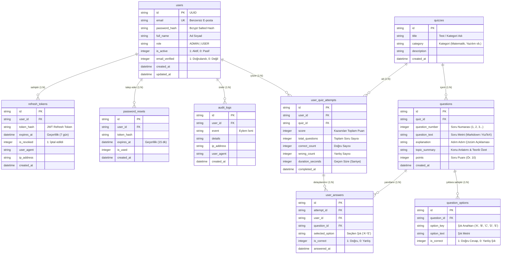

# AuthCore & Quiz System — Veritabanı Şeması ve Veri Mimarisi Dokümanı

Bu doküman, sistemde kullanılan **SQLite** veritabanının yapısını, veritabanı ayarlarını, tablo şemalarını, ilişkilerini (ER Diyagramı) ve örnek SQL sorgularını detaylı olarak açıklamaktadır.

---

## 🗄️ 1. Veritabanı Motoru ve Genel Ayarlar

* **Veritabanı Motoru**: SQLite 3 (`better-sqlite3` Node.js sürücüsü)
* **Veritabanı Dosyası**: `database.sqlite` (Proje kök dizini)
* **Günlükleme Modu (Journal Mode)**: `WAL` (Write-Ahead Logging) — Yüksek eşzamanlı okuma/yazma performansı sağlar.
* **İlişkisel Bütünlük (Foreign Keys)**: `PRAGMA foreign_keys = ON;` — İlişkili tablolar arasında bütünlüğü korur (`ON DELETE CASCADE`).

---

## 📐 2. Veritabanı Varlık-İlişki Diyagramı (ER Diagram)



---

## 📋 3. Tablo Şemaları ve Veri Tipleri (Table Specifications)

### 1. `users` (Kullanıcı Hesapları)
| Sütun | Veri Tipi | Kısıtlama | Açıklama |
| :--- | :--- | :--- | :--- |
| `id` | `TEXT` | `PRIMARY KEY` | Benzersiz Kullanıcı Kimliği |
| `email` | `TEXT` | `UNIQUE NOT NULL` | E-Posta Adresi |
| `password_hash` | `TEXT` | `NOT NULL` | Bcrypt ile Hashlenmiş Parola |
| `full_name` | `TEXT` | `NOT NULL` | Kullanıcı Adı Soyadı |
| `role` | `TEXT` | `DEFAULT 'USER'` | Kullanıcı Rolü (`ADMIN` / `USER`) |
| `is_active` | `INTEGER` | `DEFAULT 1` | Hesap Durumu (`1`: Aktif, `0`: Dondurulmuş) |
| `email_verified`| `INTEGER` | `DEFAULT 0` | E-posta Doğrulama Durumu |
| `created_at` | `DATETIME` | `DEFAULT CURRENT_TIMESTAMP` | Hesap Oluşturulma Zamanı |
| `updated_at` | `DATETIME` | `DEFAULT CURRENT_TIMESTAMP` | Son Güncellenme Zamanı |

### 2. `refresh_tokens` (Aktif Cihaz & JWT Oturumları)
| Sütun | Veri Tipi | Kısıtlama | Açıklama |
| :--- | :--- | :--- | :--- |
| `id` | `TEXT` | `PRIMARY KEY` | Jeton Kayıt ID |
| `user_id` | `TEXT` | `FOREIGN KEY (users.id) ON DELETE CASCADE` | İlgili Kullanıcı |
| `token_hash` | `TEXT` | `NOT NULL` | JWT Refresh Token Değeri |
| `expires_at` | `DATETIME` | `NOT NULL` | Son Geçerlilik Zamanı (7 Gün) |
| `is_revoked` | `INTEGER` | `DEFAULT 0` | Oturum İptal Durumu (`1`: Sonlandırıldı) |
| `user_agent` | `TEXT` | | Tarayıcı ve Cihaz Bilgisi |
| `ip_address` | `TEXT` | | İstemci IP Adresi |

### 3. `quizzes` (Soru Bankası Kategorileri)
| Sütun | Veri Tipi | Kısıtlama | Açıklama |
| :--- | :--- | :--- | :--- |
| `id` | `TEXT` | `PRIMARY KEY` | Test ID |
| `title` | `TEXT` | `NOT NULL` | Test Başlığı (Örn: Logaritma Soru Bankası) |
| `category` | `TEXT` | `NOT NULL` | Kategori (Örn: Matematik, Yazılım) |
| `description` | `TEXT` | | Test Açıklaması |

### 4. `questions` (Sorular, Soru Numaraları, Çözümler ve Konu Anlatımı)
| Sütun | Veri Tipi | Kısıtlama | Açıklama |
| :--- | :--- | :--- | :--- |
| `id` | `TEXT` | `PRIMARY KEY` | Soru ID |
| `quiz_id` | `TEXT` | `FOREIGN KEY (quizzes.id) ON DELETE CASCADE` | Bağlı Olduğu Test |
| `question_number`| `INTEGER`| `NOT NULL` | **Soru Numarası (1, 2, 3...)** |
| `question_text` | `TEXT` | `NOT NULL` | **Soru Metni (KaTeX / Markdown)** |
| `explanation` | `TEXT` | | **Soru Çözüm ve Adım Adım Açıklaması** |
| `topic_summary` | `TEXT` | | **Konu Anlatımı, Formüller ve Teorik Özet** |
| `points` | `INTEGER`| `DEFAULT 10` | Soru Puan Değeri |

### 5. `question_options` (Soru Şıkları: A, B, C, D, E)
| Sütun | Veri Tipi | Kısıtlama | Açıklama |
| :--- | :--- | :--- | :--- |
| `id` | `TEXT` | `PRIMARY KEY` | Şık ID |
| `question_id` | `TEXT` | `FOREIGN KEY (questions.id) ON DELETE CASCADE` | İlgili Soru ID |
| `option_key` | `TEXT` | `NOT NULL` | **Şık Anahtarı (`'A'`, `'B'`, `'C'`, `'D'`, `'E'`)** |
| `option_text` | `TEXT` | `NOT NULL` | **Şık Metni** |
| `is_correct` | `INTEGER` | `DEFAULT 0` | **`1`: Doğru Cevap, `0`: Yanlış Şık** |

### 6. `user_quiz_attempts` (Test Çözme Performans Kayıtları)
| Sütun | Veri Tipi | Kısıtlama | Açıklama |
| :--- | :--- | :--- | :--- |
| `id` | `TEXT` | `PRIMARY KEY` | Deneme Kayıt ID |
| `user_id` | `TEXT` | `FOREIGN KEY (users.id) ON DELETE CASCADE` | Çözen Kullanıcı |
| `quiz_id` | `TEXT` | `FOREIGN KEY (quizzes.id) ON DELETE CASCADE` | Çözülen Test |
| `score` | `INTEGER` | `NOT NULL DEFAULT 0` | Kazanılan Toplam Puan |
| `total_questions`| `INTEGER`| `NOT NULL` | Toplam Soru Sayısı |
| `correct_count` | `INTEGER` | `DEFAULT 0` | Doğru Sayısı |
| `wrong_count` | `INTEGER` | `DEFAULT 0` | Yanlış Sayısı |
| `duration_seconds`|`INTEGER`| `DEFAULT 0` | Testte Harcanan Süre (Saniye) |
| `completed_at` | `DATETIME` | `DEFAULT CURRENT_TIMESTAMP` | Tamamlanma Zamanı |

---

## 🔍 4. Örnek SQL Sorguları (Sample Queries)

### 1. Bir Testin Sorularını, Soru Numarasını ve A-E Şıklarını Getirme
```sql
SELECT 
    q.id AS question_id,
    q.question_number,
    q.question_text,
    q.explanation,
    qo.option_key,
    qo.option_text,
    qo.is_correct
FROM questions q
JOIN question_options qo ON q.id = qo.question_id
WHERE q.quiz_id = 'quiz-math-01'
ORDER BY q.question_number ASC, qo.option_key ASC;
```

### 2. Bir Kullanıcının Çözdüğü Testlerin Skor ve Başarı Geçmişi
```sql
SELECT 
    a.id AS attempt_id,
    qz.title AS quiz_title,
    a.score,
    a.correct_count,
    a.wrong_count,
    a.duration_seconds,
    a.completed_at
FROM user_quiz_attempts a
JOIN quizzes qz ON a.quiz_id = qz.id
WHERE a.user_id = 'user-demo-01'
ORDER BY a.completed_at DESC;
```

---

## 🛡️ 5. Güvenlik ve Veri Bütünlüğü Kriterleri

1. **SQL Injection Koruması**: Tüm veritabanı işlemlerinde `better-sqlite3` hazırlıklı sorguları (Prepared Statements) kullanılarak parametreler ayrıştırılır.
2. **Cascading Delete (Otomatik Temizleme)**: Bir test veya soru silindiğinde ona ait tüm şıklar (`question_options`) ve yanıtlar veritabanı seviyesinde otomatik olarak temizlenir.
